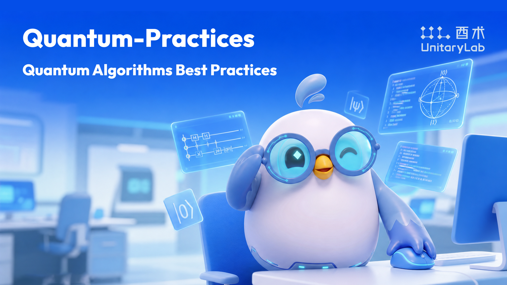

<div align="center">

<a href="https://github.com/unitarylab/quantum-practices">
  
</a>
<br>

<h1>&#9883; Quantum-Practices</h1>

<p>
  <strong>Quantum Algorithms Best Practices</strong><br/>
  <strong>量子算法 最佳实践</strong>
</p>

<p>
  
  
</p>

<p>
  <a href="#english">English</a>
  &middot;
  <a href="#chinese">中文</a>
</p>

</div>

---

<a name="english"></a>

## English

### What is this?

**Quantum-Practices** is a DeepSeek Harness tool bundle for quantum algorithm best practices. It provides structured, reviewable guidance to DeepSeek Harness agents through a read-only model-facing tool.

As a DeepSeek Harness plugin, it registers one read-only `quantum_practices` tool for listing, searching, and reading packaged quantum algorithm practice guides from an immutable build-time catalog.

Quantum-Practices is based on and adapted from the GitHub project [unitarylab/quantum-skills](https://github.com/unitarylab/quantum-skills). The original project provides the quantum algorithm guide corpus; this repository reworks that foundation into a DeepSeek Harness tool bundle with a generated, read-only practice catalog.

---

### &#10024; Key Features

- **Progressive Disclosure** — Root `SKILL.md` is lightweight; algorithm and simulator guides load only when needed.
- **DeepSeek Harness Tool Bundle** — `quantum_practices` exposes `list`, `search`, and `get` without executing code.
- **Read-Only Runtime** — No network, subprocess, filesystem writes, Python execution, credentials, or native code.
- **Best-Practice Coverage** — Primitives, linear systems, cryptography, Hamiltonian simulation, Schrodingerization, eigensolvers, gradients, quantum machine learning, state preparation, and quantum error correction.
- **Multi-Simulator Support** — UnitaryLab (recommended), Qiskit, and PennyLane, with clear selection rules.
- **GitHub-Sourced Corpus** — Practice guides are synchronized from the public GitHub upstream only.
- **Education-Friendly** — Suitable for concept explanation, circuit design, code review, and hands-on demos.

---

### &#127775; Algorithms Covered

| Category | Algorithms |
|----------|-----------|
| **Primitives** | Grover, QPE, Hadamard Test, Hadamard Transform, Amplitude Amplification, Amplitude Estimation |
| **Linear Systems** | HHL, LCU, AQC, VQLS, QSVT-QLSA, QFT, Quantum Signal Processing (QSP) |
| **Cryptography** | Shor's Algorithm, Discrete Logarithm, Simon's Algorithm |
| **Hamiltonian Simulation** | Cartan decomposition, Trotter, QDrift, Taylor Series, QSP |
| **Schrodingerization** | Advection, Heat (1D/2D) |
| **Eigensolvers** | NumPyEigensolver, VQD |
| **Gradients** | Parameter-shift, Finite-difference, Linear-combination, SPSA, Reverse-mode, QFI |
| **Quantum Machine Learning** | VQE, VQC, QAOA, QCBM, CVQNN, Fermi-Hubbard VQE |
| **State Preparation** | Mottonen, MPS, Multiplexer, Pauli, Superposition |
| **Quantum Error Correction** | qLDPC, CSS Codes, Hypergraph Product Codes |

---

### &#128187; Supported Simulators

| Simulator | When to Use | Platform |
|-----------|-------------|----------|
| **UnitaryLab** *(default)* | Learning, algorithm demos, PDE workflows | Win / macOS / Linux |
| **Qiskit** | Noise models, IBM hardware workflows | Win / macOS / Linux |
| **PennyLane** | Differentiable hybrid optimization | Win / macOS / Linux |

---

### &#128193; Repository Structure

```
quantum-practices/
|
+-- SKILL.md                    # Root practice index used by the catalog
+-- README.md
+-- package.json                # DeepSeek Harness tool-bundle metadata
+-- cordis.patch.yml            # Profile Bundle patch
+-- src/                        # DSH plugin source
+-- lib/                        # Built release artifact
|
+-- algorithms/                 # Quantum algorithm skills
|   +-- primitives/             # Grover, QPE, Hadamard test/transform, AA, AE
|   +-- linear-systems/         # HHL, LCU, AQC, VQLS, QSVT-QLSA, QFT, QSP
|   +-- cryptography/           # Shor, discrete logarithm, Simon
|   +-- hamiltonian-simulation/ # Cartan, Trotter, QDrift, Taylor, QSP
|   +-- schrodingerization/     # Advection and heat-equation workflows
|   +-- eigensolvers/           # NumPyEigensolver, VQD
|   +-- gradients/              # Parameter-shift, finite-diff, SPSA, reverse, QFI
|   +-- quantum-machine-learning/ # VQE, VQC, QAOA, QCBM, CVQNN
|   +-- state-preparation/      # Mottonen, MPS, multiplexer, Pauli, superposition
|   +-- quantum-error-correction/ # qLDPC, CSS codes
|
+-- simulators/                 # Simulator selection & installation guides
    +-- unitarylab/             # Recommended simulator guide
    +-- qiskit/
    +-- pennylane/
```

### DeepSeek Harness Plugin

For most users, install Quantum-Practices into the DeepSeek Harness profile you use, then ask your agent to consult Quantum-Practices before answering quantum algorithm questions.

If you use the Web UI:

```bash
npx @deepseek-ai/dsh@0.1.0-rc.6 plugin --profile web add \
  github:unitarylab/quantum-practices#main
```

Restart DeepSeek Harness Web after installation.

If you use the headless CLI:

```bash
npx @deepseek-ai/dsh@0.1.0-rc.6 plugin --profile headless add \
  github:unitarylab/quantum-practices#main
```

For local development, install this checkout directly:

```bash
dsh plugin --profile web add "/path/to/quantum-practices"
dsh plugin --profile headless add "/path/to/quantum-practices"
```

For review or release evidence, replace `main` with a pinned 40-character commit SHA.

Verify that the profile contains the inserted row:

```bash
dsh --profile headless --dump-config | \
  rg "tool-quantum-practices|dsh-unitarylab-quantum-practices"
```

Expected output:

```text
# == dsh-unitarylab-quantum-practices
- id: tool-quantum-practices
  name: dsh-unitarylab-quantum-practices
```

Run a functional test:

```bash
npx @deepseek-ai/dsh@0.1.0-rc.6 --profile headless \
  "Use the quantum_practices tool to find the HHL practice guide and explain the required matrix constraints."
```

After installation, users can ask naturally. The model should call `quantum_practices` in the background:

```text
Use Quantum-Practices to review HHL before explaining the matrix constraints on A.
Before writing Grover code, check Quantum-Practices and list the common implementation pitfalls.
Use Quantum-Practices to compare quantum phase estimation and the quantum Fourier transform.
Consult Quantum-Practices and recommend a simulator for a variational quantum algorithm.
Check Quantum-Practices and explain how Trotter and QDrift differ for Hamiltonian simulation.
```

By default, `get` returns a brief, token-conscious view with the most relevant sections. The model should request `detail="full"` only when the user needs full implementation notes, complete examples, or debugging context.

Developers can also inspect the tool contract directly:

```text
quantum_practices(action="list")
quantum_practices(action="search", query="HHL linear system")
quantum_practices(action="get", id="algorithms/linear-systems/hhl")
quantum_practices(action="get", query="Explain HHL matrix constraints")
quantum_practices(action="get", query="Implement HHL with a 2x2 example", detail="full")
```

The DSH plugin never executes `algorithms/**/scripts/*.py` and never installs or imports Python dependencies.

---

### Build and Verify

```bash
npm ci
npm run check
npm pack --dry-run --json
```

`npm run build` regenerates `src/generated/skill-catalog.ts` and compiles the committed `lib/` release artifact.

---

### Python Runtime

Quantum-Practices does not ship a root `requirements.txt`, bundled wheels, or a Python runtime. Any Python setup belongs to the separate project where you choose to run generated examples; it is not part of the DeepSeek Harness plugin install path.

## License

This repository source is licensed under the MIT License.

## Attribution

Quantum-Practices is a derivative adaptation of [unitarylab/quantum-skills](https://github.com/unitarylab/quantum-skills). See [NOTICE](NOTICE) for attribution details.

---

<a name="chinese"></a>

## 中文

### 这是什么？

**Quantum-Practices** 是一个面向量子算法最佳实践的 DeepSeek Harness 工具包。它通过一个只读模型工具，为 DeepSeek Harness Agent 提供结构化、可审查的量子算法实践指南。

作为 DeepSeek Harness 插件，它注册一个只读 `quantum_practices` 工具，用于从构建期固化的 Practice Catalog 中列出、搜索和读取量子算法实践指南。

Quantum-Practices 基于 GitHub 项目 [unitarylab/quantum-skills](https://github.com/unitarylab/quantum-skills) 进行二次创作。原项目提供了量子算法指南语料；本仓库在此基础上改造为 DeepSeek Harness 工具包，并生成只读的 Practice Catalog。

---

### &#10024; 核心特性

- **渐进式加载** — 根 `SKILL.md` 轻量，算法与模拟器指南仅在需要时才加载。
- **DeepSeek Harness 工具包** — `quantum_practices` 提供 `list`、`search`、`get`，不执行代码。
- **只读运行时** — 无网络、无 subprocess、无写盘、无 Python 执行、无 credentials、无 native code。
- **最佳实践覆盖** — 基元、线性系统、密码学、哈密顿量模拟、Schrodingerization、本征求解器、梯度方法、量子机器学习、态制备与量子纠错一应俱全。
- **多模拟器支持** — UnitaryLab（推荐）、Qiskit、PennyLane，附明确选型规则。
- **GitHub 来源语料** — Practice guides 仅从公开 GitHub 上游同步。
- **教学友好** — 适用于概念解释、电路设计、代码审查和动手实验。

---

### &#127775; 算法覆盖范围

| 分类 | 算法 |
|------|------|
| **基础量子算法** | Grover、QPE、Hadamard 测试、Hadamard 变换、振幅放大、振幅估计 |
| **线性系统** | HHL、LCU、AQC、VQLS、QSVT-QLSA、QFT、量子信号处理（QSP） |
| **密码学** | Shor 算法、离散对数、Simon 算法 |
| **哈密顿量模拟** | Cartan 分解、Trotter、QDrift、Taylor 级数、QSP |
| **Schrodingerization** | 对流、热方程（一维/二维） |
| **本征求解器** | NumPyEigensolver、VQD |
| **梯度方法** | 参数位移、有限差分、线性组合、SPSA、反向模式、QFI |
| **量子机器学习** | VQE、VQC、QAOA、QCBM、CVQNN、Fermi-Hubbard VQE |
| **态制备** | Mottonen、MPS、Multiplexer、Pauli、Superposition |
| **量子纠错** | qLDPC、CSS 码、超图乘积码 |

---

### &#128187; 支持的模拟器

| 模拟器 | 适用场景 | 平台 |
|--------|---------|------|
| **UnitaryLab** *(默认)* | 学习、算法演示、PDE 工作流 | Win / macOS / Linux |
| **Qiskit** | 噪声模型、IBM 硬件工作流 | Win / macOS / Linux |
| **PennyLane** | 可微分混合优化 | Win / macOS / Linux |

---

### &#128193; 仓库结构

```
quantum-practices/
|
+-- SKILL.md                    # Catalog 使用的根实践索引
+-- README.md
+-- package.json                # DeepSeek Harness tool-bundle 元数据
+-- cordis.patch.yml            # Profile Bundle patch
+-- src/                        # DSH 插件源码
+-- lib/                        # 编译后的 release artifact
|
+-- algorithms/                 # 量子算法技能
|   +-- primitives/             # Grover、QPE、Hadamard 测试/变换、振幅放大与估计
|   +-- linear-systems/         # HHL、LCU、AQC、VQLS、QSVT-QLSA、QFT、QSP
|   +-- cryptography/           # Shor、离散对数、Simon
|   +-- hamiltonian-simulation/ # Cartan、Trotter、QDrift、Taylor、QSP
|   +-- schrodingerization/     # 对流与热方程工作流
|   +-- eigensolvers/           # NumPyEigensolver、VQD
|   +-- gradients/              # 参数位移、有限差分、SPSA、反向模式、QFI
|   +-- quantum-machine-learning/ # VQE、VQC、QAOA、QCBM、CVQNN
|   +-- state-preparation/      # Mottonen、MPS、Multiplexer、Pauli、Superposition
|   +-- quantum-error-correction/ # qLDPC、CSS 码
|
+-- simulators/                 # 模拟器选型与安装指南
    +-- unitarylab/             # 推荐模拟器指南
    +-- qiskit/
    +-- pennylane/
```

### DeepSeek Harness 插件

普通用户不需要理解底层 action。把 Quantum-Practices 安装进正在使用的 DeepSeek Harness profile 之后，直接让 Agent 先查 Quantum-Practices，再回答量子算法问题即可。

如果你使用 Web UI：

```bash
npx @deepseek-ai/dsh@0.1.0-rc.6 plugin --profile web add \
  github:unitarylab/quantum-practices#main
```

安装后重启 DeepSeek Harness Web。

如果你使用 headless CLI：

```bash
npx @deepseek-ai/dsh@0.1.0-rc.6 plugin --profile headless add \
  github:unitarylab/quantum-practices#main
```

本地开发时，可以直接安装当前 checkout：

```bash
dsh plugin --profile web add "/path/to/quantum-practices"
dsh plugin --profile headless add "/path/to/quantum-practices"
```

审核或 release evidence 建议把 `main` 换成固定的 40 位 commit SHA。

验证 profile 中是否出现插入的 row：

```bash
dsh --profile headless --dump-config | \
  rg "tool-quantum-practices|dsh-unitarylab-quantum-practices"
```

期望输出：

```text
# == dsh-unitarylab-quantum-practices
- id: tool-quantum-practices
  name: dsh-unitarylab-quantum-practices
```

做一次真实功能测试：

```bash
npx @deepseek-ai/dsh@0.1.0-rc.6 --profile headless \
  "Use the quantum_practices tool to find the HHL practice guide and explain the required matrix constraints."
```

安装完成后，用户可以直接自然提问；模型应在后台调用 `quantum_practices`：

```text
请先查 Quantum-Practices，再解释 HHL 对矩阵 A 的约束。
写 Grover 代码前，请查 Quantum-Practices 并列出常见实现错误。
请根据 Quantum-Practices 比较量子相位估计和量子傅里叶变换。
请查 Quantum-Practices，并建议变分量子算法应该使用哪个 simulator。
请参考 Quantum-Practices，说明 Trotter 和 QDrift 在哈密顿量模拟中的区别。
```

默认情况下，`get` 返回省 token 的 brief 视图，只包含最相关的章节。只有当用户需要完整实现说明、完整示例或调试上下文时，模型才应该请求 `detail="full"`。

开发者也可以直接查看工具接口：

```text
quantum_practices(action="list")
quantum_practices(action="search", query="HHL linear system")
quantum_practices(action="get", id="algorithms/linear-systems/hhl")
quantum_practices(action="get", query="Explain HHL matrix constraints")
quantum_practices(action="get", query="Implement HHL with a 2x2 example", detail="full")
```

DSH 插件不会执行 `algorithms/**/scripts/*.py`，也不会安装或导入 Python 依赖。

---

### 构建与验证

```bash
npm ci
npm run check
npm pack --dry-run --json
```

`npm run build` 会重新生成 `src/generated/skill-catalog.ts`，并编译需要提交的 `lib/` release artifact。

---

### Python 运行时

Quantum-Practices 不发布根 `requirements.txt`、内置 wheel 或 Python runtime。任何 Python 环境都应属于你实际运行示例的独立项目，不属于 DeepSeek Harness 插件安装路径。

## License

本仓库源码采用 MIT License。

## Attribution

Quantum-Practices 是基于 [unitarylab/quantum-skills](https://github.com/unitarylab/quantum-skills) 的二次创作。来源说明详见 [NOTICE](NOTICE)。
